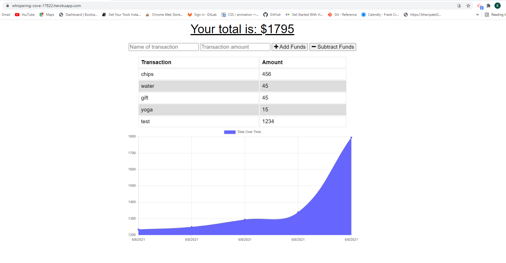

## Project Title

# Budget-Tracket

# User Story
Add functionality to our existing Budget Tracker application to allow for offline access and functionality.

## Description
The user will be able to add expenses and deposits to their budget with or without a connection. When entering transactions offline, they should populate the total when brought back online.

Offline Functionality:

## Installation Instructions
You will need following  :

* Node.js

* Express.js

* MongoDB

## Web Url :

Navigate to : https://whispering-cove-17822.herokuapp.com/

## Usage

## Mock-up 

## Contribution Guidelines
Link to Contributor's Covenant: https://www.contributor-covenant.org/version/2/0/code_of_conduct/

## License

*This project uses the [MIT](https://spdx.org/licenses/MIT.html) license.*

## Questions
Github Profile : [Creator]:(https://github.com/bhavipatel21)

If you have any questions please email me at bhavij0511@gmail.com
